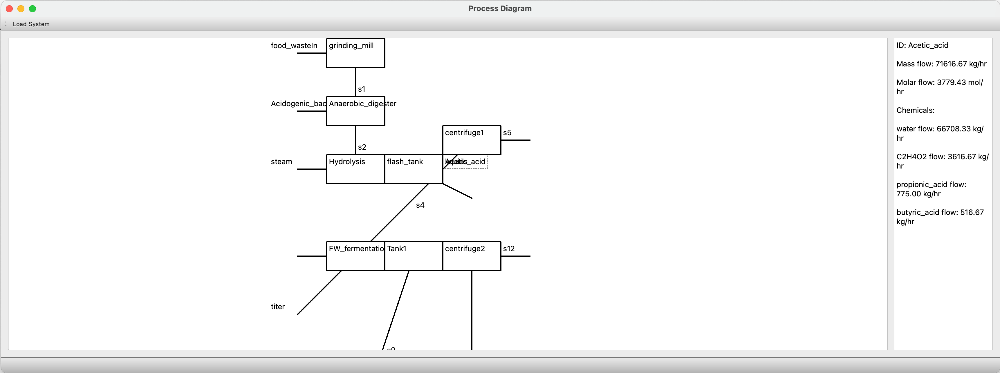

# Installation
This package loads a graphical user interface to work with biosteam systems.

Install Git: https://git-scm.com/downloads
Install the sesaCanvas package using pip:
```
pip install git+https://github.com/markjet7/sesaCanvas/ 
```
# Usage 
This program is meant to be run from the command line or terminal.
```bash
python -m sesaCanvas.sesaCanvas
```

After running the program, you can click on "Load System" to load a biosteam system from a python file. 
The system will be displayed in the canvas. You can click on the stream labels to see the stream properties.
# Screenshot

